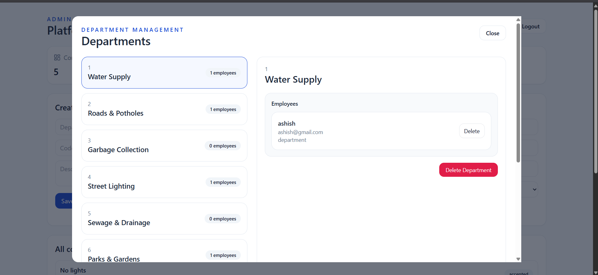
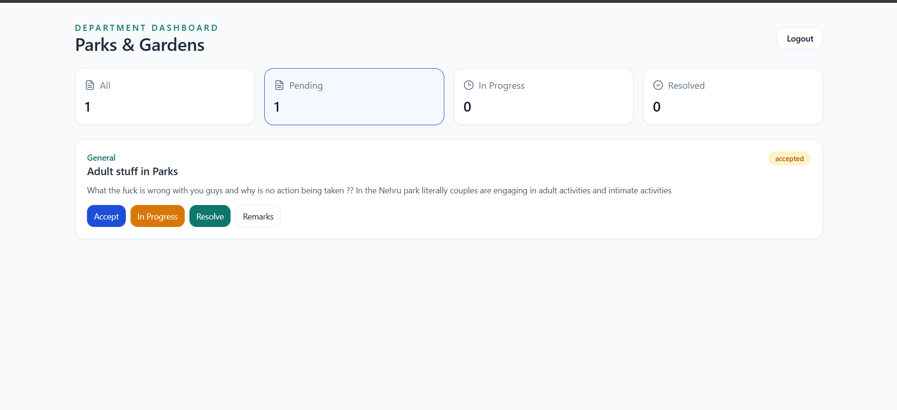
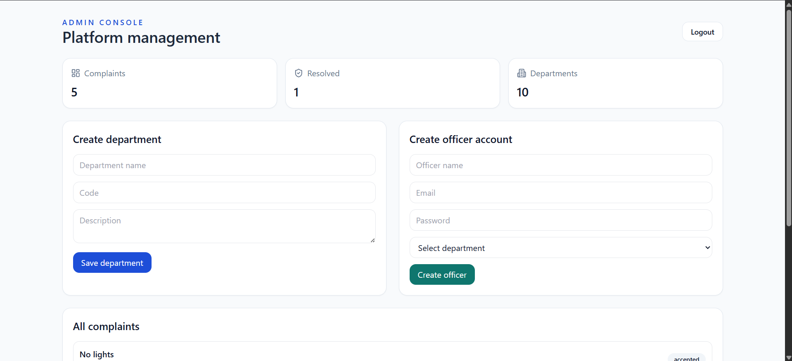
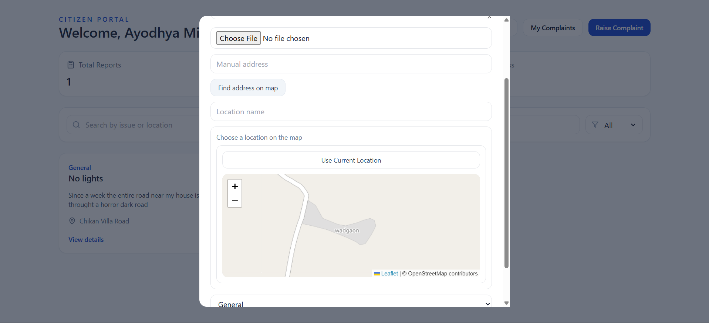

# CivicFix AI 🚀

An AI-powered civic complaint management system built using the MERN Stack, FastAPI, and Hugging Face Transformers.

## 📌 Overview

CivicFix allows citizens to report civic issues such as potholes, garbage collection, water supply, electricity, sewage, traffic signals, etc.

Instead of manually selecting the responsible department, an AI model automatically predicts the correct department from the complaint description.

The complaint is then routed directly to the respective municipal department.

---

## ✨ Features

### Citizen Portal

- Register/Login
- Raise complaints
- Upload complaint images
- Interactive location picker
- Automatic address detection
- AI-based department prediction
- Track complaint status
- View department remarks
- Give feedback after resolution

---

### Department Portal

- Department-wise complaint dashboard
- Accept complaints
- Update complaint status
- Add remarks
- View complaint details
- View uploaded complaint images

---

### Admin Portal

- Create departments
- Create department employees
- View all complaints
- Assign department users
- Delete departments
- Delete department employees

---

## 🤖 AI Module

The AI service is built separately using **FastAPI**.

### Base Model

- DistilBERT (`distilbert-base-uncased`)

### Frameworks

- Hugging Face Transformers
- PyTorch
- Scikit-learn
- FastAPI

### Task

Multi-class text classification for automatic civic complaint routing.

### Supported Departments

- Electricity
- Garbage Collection
- Parks & Gardens
- Public Transport
- Roads & Potholes
- Sewage & Drainage
- Street Lighting
- Traffic Signals
- Water Supply
- Other

---

## 🛠 Tech Stack

### Frontend

- React
- Tailwind CSS
- Axios
- Leaflet Maps

### Backend

- Node.js
- Express.js
- MongoDB
- JWT Authentication
- Multer

### AI Service

- FastAPI
- Hugging Face Transformers
- PyTorch
- Scikit-learn

---

## Project Structure

```
CivicFixFinal
│
├── frontend
├── backend
└── ai-service
```

---

## Installation

### Clone Repository

```bash
git clone https://github.com/YOUR_USERNAME/CivicFix-AI.git
```

### Install Frontend

```bash
cd frontend
npm install
npm run dev
```

### Install Backend

```bash
cd backend
npm install
npm run dev
```

### Install AI Service

```bash
cd ai-service

python -m venv venv

venv\Scripts\activate

pip install -r requirements.txt

uvicorn app:app --reload
```

---

## AI Model

The trained model is **not included** in this repository because GitHub limits file sizes to 100 MB.

The repository contains:

- Complete training pipeline
- Dataset
- FastAPI inference service

To generate the model:

```bash
python train.py
```

---

## Current Version

✅ CivicFix AI V1.0

### Completed

- Citizen Portal
- Department Portal
- Admin Portal
- AI Department Prediction
- Complaint Routing
- Interactive Map
- Complaint Status Tracking
- Feedback System

---

# Screenshots

## Citizen Dashboard


---

## Department Management



---

## Department Dashboard



---

## Admin Dashboard



---

## Complaint



## Future Improvements (V2)

- Complaint Priority Prediction
- Duplicate Complaint Detection
- AI Complaint Summarization
- Analytics Dashboard
- Email Notifications
- Deployment on Cloud

---

## Author

**Ajeet Mishra**

Final Year Computer Engineering Student

Built as a full-stack AI-powered civic complaint management system.